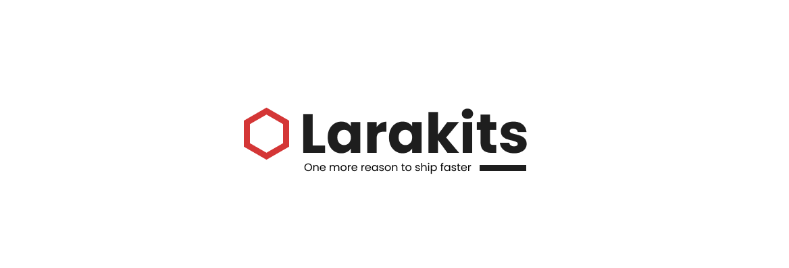

    

---

Hello World! Larakits is an open-source SaaS platform that automatically curates Laravel community-maintained starter kits. You can perform advanced search filtering specific to Laravel's ecosystem such as tech stack.

## Changelog

Please see [CHANGELOG](CHANGELOG.md) for more information on what has changed recently.

## Contributing

Please see [CONTRIBUTING](CONTRIBUTING.md) for details.

## License

Larakits is an open-sourced software licensed under the **[GNU Affero General Public License](LICENSE.md)**